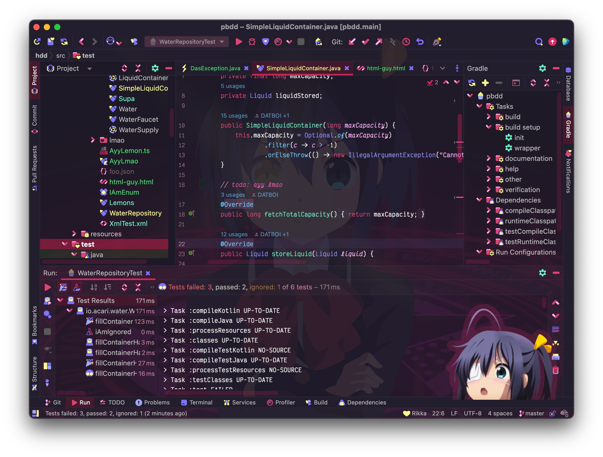

Doki Theme Icons
---

    </img>

A nice mix of cool and cute icons to compliment your favorite theme!

---

# Documentation

- [Design Vision](#design-vision)
  - [Color Palette](#color-palette)
- [Miscellaneous](#miscellaneous)
  - [Attribution Requirements](#attribution-requirements)
  - [Contributing](#contributing)
  - [Helping the community](#enjoying-these-icons)
  - [Feature Requests](#contributions)

# Design Vision

I was tired of having other people decide what _their_ user experience should look like.
Therefore, I built my _own_ set of user interface icons. Meaning can now reject their reality and substitute it with my
own.

All these icons where lovingly handcrafted to give off cute vibes. Even though it was a pain it the butt to make all of them.
[Following the heuristics of cute](https://www.howtosmile.org/resource/smile-000-000-000-697), each icon exhibits some
attribute of cuteness such as (but not limited to):

- Short lengths relative to wider widths.
- Large rounded corners, while trying to avoid sharp edges & corners

There are also some icons that don't adhere to this theme, but I added them anyway because I liked them or they have a
special meaning to me.

Hey, it's my icon set, I should be allowed to add things _I_ want. :)

## Color Palette

Now you might be thinking to yourself: "Why do all these icons have such a weird color scheme?"

The answer to that is not straight forward, but there is a meaning to it. (I promise!)

See I have a boat load of themes that I support now, and there is **no** way I can choose just one color palette to
match them all.
Instead, I chose to design a palette that allows me to be creative while following a guide to help me build something
pleasant to look at.

Each of the colors have a name and a specific purpose.

Each Doki theme has the concept of an over arching `accentColor` which provides the underlying highlight color for each theme.
I wanted a pair of colors that works well with this foundational color. This is where the `iconAccent` & `iconAccentCompliment` come into play.
These strong/vibrant colors work well together and are a nice pairing with the Doki theme `accentColor`.
Given they work well together does not necessary mean they are very readable. 
Which means that any icon that require a good readable contrast to understand it's meaning, shouldn't use the colors.

To create icons that are readable and colorful, I needed another set of colors that work well together.
These colors are the glue that tie the character's theme together. They are foundational in their purpose.
They should be mild and most likely similar to one another in function. They essentially need to _blend_ together.
That is what `iconBaseBlend` & `iconSecondaryBlend` colors purpose is within this palette system.

In order to guarantee that I can make an icon that is readable, I needed a color that contrasts both of the blend colors nicely.
That way I can combine an icon with one of the blend colors and the compliment and end up with an icon you can read and looks nice.
Which is the purpose of the `iconBlendContrast`.

On the other end of the spectrum is the `iconBlendCompliment`, which looks good/vibrant with the blend colors but isn't necessary very usable in the contrast department.
This allows me to give the necessary splash of color that really ties together the theme!

Lastly is the `iconDiversification`, it's purpose is to be a bit different and should be used sparingly.
I've put it on an icon or two that  show up enough times to give a more diverse color palette, while not throwing things out of balance.

And I have `iconError` color. Haven't used it yet, haven't decided if I wanted action colors in my theme suite yet.
It's there, but not used very much at the moment.

| Name                 | Hex Color                                                   |
|----------------------|-------------------------------------------------------------|
| iconAccent           |  #6ee4f8 |
| iconAccentCompliment |  #1785ff |
| iconBaseBlend        |  #6e85f8 |
| iconSecondaryBlend   |  #9a8bff |
| iconBlendCompliment  |  #ff8bf5 |
| iconDiversification  |  #ff958b |
| iconBlendContrast    |  #73ff9d |
| iconError            |  #e62d94 |

The end result is a palette that I can map various colors for each Doki theme to.

# Miscellaneous

## Attribution Requirements

As an open source project, attribution is critical from a legal, practical and motivational perspective in my opinion.
The graphics are licensed under the CC-BY 4.0 which has a pretty good guide
on [best practices for attribution](https://wiki.creativecommons.org/Best_practices_for_attribution).

However, I consider the guide a bit onerous and as a project, and will accept a mention in a project README or an '
About' section or footer on a website. In mobile applications, a common place would be in the Settings/About section. I
would consider a mention in the HTML/JS source sufficient also.

## Contributing

If you would like to help out with the project, then you'll want to check out the [CONTRIBUTING.md](./CONTRIBUTING.md)  for more details.

## Enjoying these icons?

Great! I am glad you like it!

Be sure to ⭐ and share it with other weebs!

## Contributions?

I think your voice needs to be heard! You probably have good ideas, so feel free to submit your feedback
as [an issue](https://github.com/doki-theme/doki-theme-jupyter/issues/new).

Help make this plugin better!

---

    </img>

