| add.svg                                                                           | angle_braces.svg                                                                             | arrow_bottom_left.svg                                                               |
| --------------------------------------------------------------------------------- | -------------------------------------------------------------------------------------------- | ----------------------------------------------------------------------------------- |
|                                               |                                        |                     |
| arrow_right.svg                                                                   | arrow_upper_right.svg                                                                        | avatar.svg                                                                          |
|                               |                              |                                           |
| bean.svg                                                                          | boat.svg                                                                                     | bookmark.svg                                                                        |
| 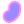                                            |                                                        |                                       |
| bow.svg                                                                           | breakpoint.svg                                                                               | build_close.svg                                                                     |
|                                               |                                            |                                  |
| build.svg                                                                         | check.svg                                                                                    | cheemsburbger.svg                                                                   |
|                                           |                                                      |                             |
| cherry.svg                                                                        | chevron_down.svg                                                                             | chevron_left.svg                                                                    |
| 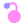                                        |                                        |                               |
| chevron_right.svg                                                                 | chevron_up.svg                                                                               | circle.svg                                                                          |
|                           |                                            |                                           |
| clear_text.svg                                                                    | close.svg                                                                                    | cloud_outline.svg                                                                   |
| 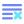                                |                                                      |                             |
| cloud.svg                                                                         | collapse_all.svg                                                                             | comma_glyph.svg                                                                     |
|                                           |                                        |                                 |
| commit_horizontal.svg                                                             | commit_vertical.svg                                                                          | config.svg                                                                          |
|                   |                                  |                                           |
| copy.svg                                                                          | coverage.svg                                                                                 | cowfee.svg                                                                          |
|                                             |                                                |                                           |
| css.svg                                                                           | cupcake_refresh.svg                                                                          | cupcake.svg                                                                         |
|                                               | 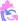                                  |                                         |
| curly_braces.svg                                                                  | db_solid.svg                                                                                 | db.svg                                                                              |
|                             |                                                |                                                   |
| debug.svg                                                                         | dependencies.svg                                                                             | disabled_breakpoint.svg                                                             |
|                                           |                                        | 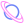                |
| dna.svg                                                                           | docker.svg                                                                                   | doki_icon_logo.svg                                                                  |
|                                               |                                                    |                           |
| doki_icon_settings.svg                                                            | doki_icon.svg                                                                                | dual_chevrons.svg                                                                   |
|                  |                                              |                             |
| dual_panels_refresh.svg                                                           | dual_panels.svg                                                                              | edit.svg                                                                            |
| 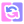               | 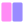                                         |                                               |
| ellipsis_horizontal.svg                                                           | ellipsis_vertical.svg                                                                        | error_circle.svg                                                                    |
|               |                              |                               |
| evaluate_expression_kotlin.svg                                                    | evaluate_expression.svg                                                                      | excludedFolder.svg                                                                  |
|  | 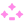                         |                            |
| expand_all.svg                                                                    | file_close.svg                                                                               | file_config.svg                                                                     |
|                                 | 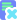                                            |                                  |
| file_edit.svg                                                                     | file_heart.svg                                                                               | file_kotlin.svg                                                                     |
|                                    |                                             |                                  |
| file.svg                                                                          | filter.svg                                                                                   | flash_star.svg                                                                      |
|                                             |                                                    |                                   |
| folder_cowfee.svg                                                                 | folder_db_solid.svg                                                                          | folder_heart.svg                                                                    |
|                            |                                   |                                |
| folder_hex_stack_glyph.svg                                                        | folder_library.svg                                                                           | folder_settings.svg                                                                 |
|          |                                     |                          |
| folder_test.svg                                                                   | folder.svg                                                                                   | force_step_into.svg                                                                 |
|                                |                                                    |                         |
| game_kun.svg                                                                      | ghost.svg                                                                                    | graph.svg                                                                           |
|                                     |                                                      | 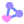                                            |
| group.svg                                                                         | heart.svg                                                                                    | help.svg                                                                            |
| 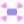                                          |                                                      |                                               |
| hex_glyph_duex.svg                                                                | hex_heart_glyph.svg                                                                          | hex_outline_glyph.svg                                                               |
|                         |                                  |                     |
| hex_stack_glyph.svg                                                               | hidden_toolbar.svg                                                                           | hide.svg                                                                            |
|                       |                                    |                                               |
| history.svg                                                                       | hollow_square_circle_glyph.svg                                                               | ice_cream.svg                                                                       |
|                                       |            |                                     |
| image.svg                                                                         | info_circle.svg                                                                              | intertwine.svg                                                                      |
|                                           |                                          |                                   |
| jar.svg                                                                           | jest.svg                                                                                     | key.svg                                                                             |
|                                               | 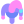                                                       |                                                 |
| kotlin.svg                                                                        | layout_dual_chevrons.svg                                                                     | layout.svg                                                                          |
|                                         | 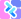                        | 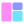                                          |
| library.svg                                                                       | light_house.svg                                                                              | lightning_bolt.svg                                                                  |
|                                       | 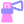                                         |                           |
| link.svg                                                                          | linked_angle_braces.svg                                                                      | locate.svg                                                                          |
|                                             |                          |                                           |
| locked.svg                                                                        | mamsnrhbr_chehfde.svg                                                                        | neko_glyph_kotlin.svg                                                               |
|                                         | 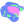                             |                      |
| neko_glyph.svg                                                                    | network_graph.svg                                                                            | no_view.svg                                                                         |
|                                 |                                      |                                         |
| notifications_heart.svg                                                           | notifications.svg                                                                            | npm.svg                                                                             |
|                |                                      |                                                 |
| open.svg                                                                          | optical_glyph.svg                                                                            | outline_circle_glyph_kotlin.svg                                                     |
|                                             | 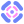                                     |  |
| outline_circle_glyph.svg                                                          | outline_rectangle_glyph.svg                                                                  | outline_square_glyph.svg                                                            |
|             | 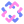                 |               |
| package.svg                                                                       | partial_hex_glyph_kotlin.svg                                                                 | partial_hex_glyph.svg                                                               |
|                                        |                 | 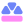                    |
| partial_ring_glyph.svg                                                            | partial_triangle_glyph.svg                                                                   | pause.svg                                                                           |
|                 |                    |                                             |
| pin.svg                                                                           | play_solid.svg                                                                               | play.svg                                                                            |
|                                               |                                            |                                               |
| plugin.svg                                                                        | pretzel_refresh.svg                                                                          | pretzel.svg                                                                         |
|                                         |                                   |                                         |
| printer.svg                                                                       | profile.svg                                                                                  | project_glyph.svg                                                                   |
|                                       |                                                  |                             |
| pull_request.svg                                                                  | rating_1.svg                                                                                 | rating_2.svg                                                                        |
|                             |                                                |                                       |
| rating_3.svg                                                                      | rating_4.svg                                                                                 | rating.svg                                                                          |
|                                     |                                                |                                           |
| re_run.svg                                                                        | rectangle_triangle_circle_glyph.svg                                                          | recursion.svg                                                                       |
|                                         |  | 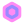                                    |
| refresh.svg                                                                       | restart.svg                                                                                  | resume.svg                                                                          |
|                                       |                                                  |                                           |
| revert.svg                                                                        | rip_outline.svg                                                                              | rip_play_solid.svg                                                                  |
|                                         | 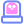                                         |                            |
| rip.svg                                                                           | scratches.svg                                                                                | scroll_to_end.svg                                                                   |
|                                               |                                              |                             |
| search_left.svg                                                                   | search_right.svg                                                                             | services.svg                                                                        |
|                               |                                        | 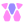                                      |
| settings.svg                                                                      | skull.svg                                                                                    | soft_wrap.svg                                                                       |
|                                     |                                                      |                                     |
| solid_doki_glyph.svg                                                              | solid_trapezoid_glyph.svg                                                                    | solid_triangle_glyph.svg                                                            |
|                     |                      | 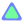              |
| space_glyph.svg                                                                   | spiral_glyph_kotlin.svg                                                                      | spiral_glyph.svg                                                                    |
|                               |                           |                               |
| square_braces.svg                                                                 | square_star_glyph.svg                                                                        | star_bar_glyph.svg                                                                  |
|                           |                              | 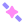                          |
| star_outline_glyph.svg                                                            | star_outline.svg                                                                             | star_pentagon_glyph.svg                                                             |
| 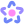                |                                        | 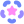                |
| star_ring_glyph.svg                                                               | star.svg                                                                                     | step_into.svg                                                                       |
| 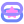                      |                                                        |                                     |
| step_out.svg                                                                      | step_over.svg                                                                                | stop_solid.svg                                                                      |
|                                     |                                              |                                   |
| stop.svg                                                                          | structure.svg                                                                                | subtract.svg                                                                        |
|                                             |                                              |                                       |
| tab.svg                                                                           | tada_view_filled.svg                                                                         | tada.svg                                                                            |
|                                               | 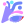                                | 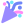                                              |
| tag.svg                                                                           | terminal_solid.svg                                                                           | terminal.svg                                                                        |
|                                               |                                    |                                       |
| test_outline_view_filled.svg                                                      | test_outline.svg                                                                             | test.svg                                                                            |
|      |                                        |                                               |
| todo.svg                                                                          | trash.svg                                                                                    | trigram.svg                                                                         |
|                                             |                                                      | 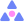                                        |
| unlocked.svg                                                                      | update.svg                                                                                   | vcs_solid.svg                                                                       |
|                                     |                                                    |                                     |
| vcs.svg                                                                           | view_filled.svg                                                                              | view.svg                                                                            |
|                                               |                                          |                                               |
| vim.svg                                                                           | warning_circle_filled.svg                                                                    | warning_circle.svg                                                                  |
|                                                |                      |                           |
| warning_triangle.svg                                                              | watch.svg                                                                                    |                                                                                     |
| 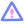                    |                                                      |                                                                                     |